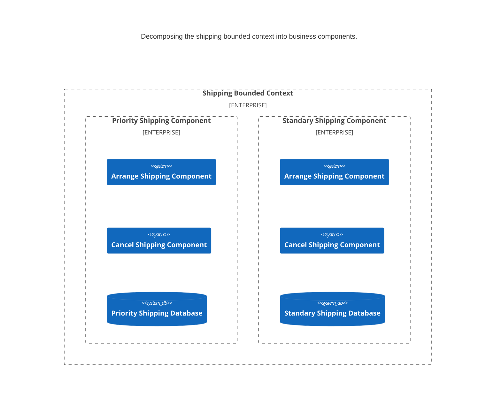

* [Part 1: DDD 总览](#part-1-ddd-总览)
  * [DDD 要解决的问题](#ddd-要解决的问题)
  * [问题域](#问题域)
  * [问题空间](#问题空间)
  * [解空间](#解空间)
  * [Strategic Patterns](#strategic-patterns)
  * [Tactical Patterns](#tactical-patterns)
  * [领域](#领域)
  * [子域](#子域)
  * [逻辑概念和物理概念](#逻辑概念和物理概念)
  * [通用语言](#通用语言)
  * [领域模型](#领域模型)
  * [限界上下文](#限界上下文)
  * [模式](#模式)
* [Part 2: DDD 原则与实践](#part-2-ddd-原则与实践)
  * [DDD Intro](#ddd-intro)
  * [对问题域进行提取](#对问题域进行提取)
  * [识别核心域](#识别核心域)
  * [Model Driven Design](#model-driven-design)
  * [领域模型实现模式](#领域模型实现模式)
  * [Bounded Context](#bounded-context)
  * [上下文映射](#上下文映射)
  * [应用架构](#应用架构)
  * [DDD 的常见问题](#ddd-的常见问题)
  * [DDD 的实施](#ddd-的实施)
* [Part 3: 战略模式](#part-3-战略模式)
  * [集成限界上下文](#集成限界上下文)
  * [通过消息系统集成](#通过消息系统集成)
* [Part 4: 战术模式](#part-4-战术模式)
  * [模型模式](#模型模式)
  * [生命周期模式](#生命周期模式)
  * [显露模式](#显露模式)

## Part 1: DDD 总览

在深入 DDD 细节之前，先从对 DDD 的基本思想进行概括。

### DDD 要解决的问题

存在的问题：复杂问题域的挑战。

* 反模式：「大泥球」模式。领域复杂性和技术复杂性被混合在一起，导致了软件维护困难
  * 举个例子：一个 BBS 领域中，和 Post、Forum、Discussion 等概念相关联的是 Author；而不应该和「用户权限」相关联；如果把 BBS 领域中的概念和「用户权限」的相关概念关联起来，就可能造成后期难于维护

* [通用语言](#通用语言)和「问题域知识」的缺乏使得软件不能和「业务逻辑」对应，导致了「大泥球」模式。也使得「分析模式」和「代码」之间转换的代价极其高昂

>「分析模式」是一种表现形式，使得非技术人员能够理解软件的逻辑和结构

* 如果不围绕着[问题域](#问题域)来设计和和组织软件的开发，会导致复杂度快速提升

如何来解决复杂**[问题域](#问题域)**？DDD 提出了**[战略模式](#strategic-patterns)**和**[战术模式](#tactical-patterns)**。

在 DDD 中，整体的建模和设计过程大致为：

* 挖掘「User Stories」（即「User Cases」收集）
* 建立 [UL](#通用语言)
* [战略模式](#strategic-patterns)设计
* [战术模式](#tactical-patterns)设计

> 但以上过程并不是线性的过程，而可能是「螺旋上升」不断优化的过程。

在具体介绍 DDD 的细节之前，先简要引入各种 DDD 的概念。

### 问题域

问题域：Problem Domain。

什么是[问题域](#问题域)？

[问题域](#问题域)指的是当前正在构建的软件的主要范围（Subject Area）。DDD 强调的是在构建大型复杂软件时，必须把对[问题域](#问题域)的关注放在最高的位置。

例如，在构架一个医疗相关的软件时，不是要去了解怎么成为一个医生，而是要专注于该领域的术语，不同的利益方看待病人的不同方式，以及医生需要收集哪些信息，并且怎么处理这些信息。

DDD 的目的就是用来应对 2 大挑战：

1. 理解[问题域](#问题域)
1. 创建出长期可维护的解决方案来解决[问题域](#问题域)中的问题

DDD 利用多种[战略模式](#strategic-patterns)和[战术模式](#tactical-patterns)来解决这 2 大挑战。

所有的**[战略模式](#strategic-patterns)**和**[战术模式](#tactical-patterns)**都是用来管理[问题空间](#问题空间)和[解空间](#解空间)中的复杂性。

### 问题空间

DDD 首先强调[问题空间](#问题空间)和[解空间](#解空间)的概念。

问题空间：Problem Space。

在解决问题之前，要先专注在对业务[问题域](#问题域)的理解。

DDD 首先强调的是定义[问题空间](#问题空间)，在[问题空间](#问题空间)定义问题。

[问题空间](#问题空间)事实上就是[领域](#领域)和[子域](#子域)的组合（也就是[问题域](#问题域)）。

* 也就是先把精力集中在识别、提炼[问题域](#问题域)（Problem Domain）上
* 把大的「领域」（Domain）分解为多个小的[子域](#子域)（Subdomain）

### 解空间

解空间：Solution Space。

在理解了[问题域](#问题域)后，在[解空间](#解空间)解决问题（也就是用代码来解决问题）。

[解空间](#解空间)是一个或多个[限界上下文](#限界上下文)，也就是一组特定的「软件模型」（DDD 里面可以采用[领域模型](#领域模型)作为「软件模型」）。

> 注：但「软件模型」也不仅仅只有[领域模型](#领域模型)，根据场景的不同，可以采用其他更简单的「软件模型」

* 先在[问题空间](#问题空间)，针对[领域](#领域)、[子域](#子域)进行提炼
  * 识别出「核心子域」、「支撑子域」、「通用子域」
* 然后在[解空间](#解空间)对[限界上下文](#限界上下文)进行分析
  * 盘点现有「软件资产」、创建哪些新「软件资产」、如何对「软件资产」集成
  * 在[解空间](#解空间)要重点关注「核心子域」的解决方案

### Strategic Patterns

[战略模式](#strategic-patterns)：strategic patterns。

* DDD 的[战略模式](#strategic-patterns)：The strategic patterns of DDD distill the **problem domain** and shape the architecture of an application
  * 翻译：DDD 的[战略模式](#strategic-patterns)对**[问题域](#问题域)**进行提炼，并依此塑造出应用的架构

[战略模式](#strategic-patterns)包括以下工作模式：

* 在[问题空间](#问题空间)，从[问题域](#问题域)中提炼出现实世界中最重要的部分
  * 把[领域](#领域)分割成[子域](#子域)更容易管理
  * 并识别出为「核心域」的[子域](#子域)
* 在[解空间](#解空间)，给每个[子域](#子域)创建一个「软件模型」来解决领域问题
  * 使「业务逻辑」和「软件代码」保持一致
  * 对不同复杂度的[子域](#子域)使用不同的「设计模式」来实现「软件模型」
* 基于[通用语言](#通用语言)的协作
  * [通用语言](#通用语言)是保持「软件模型」和「分析模型」一致的保障
* 「模型」必须是建立在[限界上下文](#限界上下文)（Bounded contexts）之中
* 理解[限界上下文](#限界上下文)之间的关系：[上下文映射]( #上下文映射 )

### Tactical Patterns

[战术模式](#tactical-patterns)：tactical patterns，也叫做 **model building blocks**（模型构建块）。

DDD 中使用[战术模式](#tactical-patterns)一个重要理由是：由于「核心域」中的「业务逻辑」十分复杂，为了在「核心域」中建立起正确的「领域模型」，需要借助[战术模式](#tactical-patterns)来实现。

* DDD 的[战术模式](#tactical-patterns)：其实就是一系列的设计「模式」，这些「模式」用来帮助开发人员更有效的创建[限界上下文](#限界上下文)中的「模型」（很多时候是针对代码层面）
* [战术模式](#tactical-patterns)要解决的是[限界上下文](#限界上下文)内部的实现细节

### 领域

领域：Domain。

什么是[领域](#领域)？广义上，[领域](#领域)就是当前组织在做的事情，以及这个组织做这些事情所处的世界。

当我们为一个组织开发一个软件系统时，我们就工作在这个组织的[领域](#领域)当中。

### 子域

子域：Subdomain。

* DDD 强调每个组织是由多个[子域](#子域)组成的；而不是一个组织对应单个[领域](#领域)。
  * 企图把整个领域实现在单个系统内，事实上是相当难的：随着系统复杂度的不断提高，面对新的业务需求，单个系统最后无法维护
  * 例如，一个「在线零售」业务的[领域](#领域)可能是由 5 个[子域](#子域)构成的：商品类目、发票、支付、物流、库存

* DDD 提供了[战略模式](#strategic-patterns)帮助开发人员把[领域](#领域)从**逻辑**上切分为多个[子域](#子域)
* 使用[战略模式](#strategic-patterns)并不是要对现有系统重新划分进行重构，而是先从「逻辑」上把[子域](#子域)识别出来
* 先使用[战略模式](#strategic-patterns)识别出「核心子域」 、「通用子域」、「支撑子域」
  * 「核心域」才是公司的价值所在，公司只对「核心域」重点投入（人力，物力）
  * 对于其他[子域](#子域)，无需投入大量精力，可以采用简单的实现方式，甚至直接购买现成产品

### 逻辑概念和物理概念

[领域](#领域)和[子域](#子域)都是**逻辑**上的概念。

> 在画图的时候，对[子域](#子域)的边界使用虚线（逻辑概念）。

**逻辑**概念相对应的是**物理**概念。

> **物理**概念关注的重点是在真实系统中，在**物理**上如何把**逻辑**概念通过代码来实现。

### 通用语言

通用语言：Ubiquitous Language（UL）。

* 在[通用语言](#通用语言)（UL）还没有被提炼出来的时候，可以借助「图」，「术语表」等辅助工具来把[通用语言](#通用语言)提炼出来
* 但这些工具仅仅在开始的时候使用，真正能保持和「业务逻辑」一致的只有代码。所以最后要把「图」，「术语表」这些东东到后来都要抛弃掉
* UL 是 DDD 的 2 大强大的工具（UL 和 [限界上下文](#限界上下文)）之一
* [通用语言](#通用语言)中的概念只有在确定的[限界上下文](#限界上下文)才具备确定的含义；UL 和[限界上下文](#限界上下文)是一对一的关系
* Ubiquitous means “pervasive,” or “found everywhere,” as spoken among the team and expressed by the single domain model that the team develops
  * 这里的「通用」意味着「无处不在」或「每处都能发现」，也就是会在团队内部（无论团队内什么角色：开发、测试、业务专家……）广泛使用，用于表达单个「领域模型」

### 领域模型

领域模型：Domain Model。

[领域模型](#领域模型)是[解空间](#解空间)中的概念。

* 什么是[领域模型](#领域模型)？[领域模型](#领域模型)就是某个特定业务领域的「软件模型」；[领域模型](#领域模型)也就是把从这个业务提炼出来的[通用语言](#通用语言)（UL）表示为软件模型
* [领域模型](#领域模型)一般通过「对象模型」来实现
  * 这些对象同时包含数据和行为
  * 这些数据和行为能准确的表达业务含义

* [领域模型](#领域模型)存在于[限界上下文](#限界上下文)之内，在[限界上下文](#限界上下文)中对「模型」进行开发。也就是[领域模型](#领域模型)的所有「基础部件」（Building Blocks）都处于[限界上下文](#限界上下文)之内
  * [领域模型](#领域模型)的概念（属性和操作）只在对应的[限界上下文](#限界上下文)中有意义

* [通用语言](#通用语言)之外的概念不应该被引入到[领域模型](#领域模型)中

「领域模型」相关的更多实践细节请参考：[领域模型实践](#domain-model)。

### 限界上下文

限界上下文：Bounded Context。

[限界上下文](#限界上下文)是[物理](#逻辑概念和物理概念)的概念。

[限界上下文](#限界上下文)是包含了[领域模型](#领域模型)的明确边界。

> 和[领域](#领域)、[子域](#子域)等**逻辑**概念相对应的是**物理**概念；也就是在真实系统中，在物理上如何把逻辑概念通过代码来实现。
> [领域模型](#领域模型)和[限界上下文](#限界上下文)都是物理概念，都和真实系统以及代码实现相关。
>
> 总之，在逻辑上，通过[战略模式](#strategic-patterns)把[领域](#领域)分为若干[子域](#子域)；然后在物理上，在[限界上下文](#限界上下文)中完成对[领域模型](#领域模型)的开发。

在[限界上下文](#限界上下文)中的术语，只在当前[限界上下文](#限界上下文)有效。

「限界上下文」的更多细节在后面会有更多[介绍](#bounded-context)。

### 模式

DDD 提供了 2 大类模式作为方法论：

* [战略模式](#strategic-patterns)：Strategic Pattern
* [战术模式](#tactical-patterns)：Tactical Pattern

DDD 的[战略模式](#strategic-patterns)能使得产品的「核心部分」和「通用区域」分割开了，避免修改「核心部分」时影响到整个产品。

产品的「核心部分」（极其复杂+频繁变动）必须是基于「模型」的。

DDD 的[战术模式](#tactical-patterns)（同时配合 Model-Driven Design）帮助开发人员针对 Domain，创建出代码级别的「模型」。「模型」是物理概念：

* 「模型」是分离复杂性，让「软件」能够持续进化的关键
* 「模型」也是在[问题域](#问题域)上和其他开发人员以及领域专家沟通的关键

下面的章节开始详细介绍 DDD 的各种细节。准备分 3 部分来介绍：

* DDD 基础理念，以及 DDD 的原则与实践
* DDD 的[战略模式](#strategic-patterns)（strategic pattern）
* DDD 的[战术模式](#tactical-patterns)（tactical pattern）

## Part 2: DDD 原则与实践

先介绍第一部分：DDD 的原则和实践。

之后会再分别介绍其他 2 个部分：[战略模式](#strategic-patterns)和[战术模式](#tactical-patterns)。

### DDD Intro

#### DDD 解决复杂问题域

DDD 如何利用[战略模式](#strategic-patterns)和[战术模式](#tactical-patterns)来解决复杂问题域的[问题](#ddd-要解决的问题)？

DDD [战略模式](#strategic-patterns)的主要工作模式如下：

* 识别出「核心域」，找到软件真正的价值所在，「核心域」才是真正值得投资的部分。避免「大泥球」模式的出现
* 在[解空间](#解空间)中，为每个[子域](#子域)（Subdomain）构建一个「软件模型」来和「业务逻辑」对齐。不过由于不同的[子域](#子域)的重要性及复杂度不同，所付出的实现代价也就不同（例如，不复杂的子领域，甚至可以不用面向对象模型来构建）
* 既然「模型」是由「领域专家」和「开发人员」合作建立起来的，所以一套不断进化的[通用语言](#通用语言)（UL）是必须的。「分析模型」中的新概念会通过 UL 反馈到「代码」中，「代码」中的概念也会被复制到 UL 中
* 「模型」属于[限界上下文](#限界上下文)（Bounded Context），[限界上下文](#限界上下文)定义了「模型」的应用范围，同时确保了「模型」的完整性。这种围绕着模型的保护边界可以防止软件变成「大泥球」模式（「模型」被隔离在自己的边界内变化，避免把复杂度扩展到其他「上下文」）
* Context Map 用来表现处于不同「上下文」中的「模型」的关系

#### DDD 实践原则

一些 DDD 实践原则：

* 集中在「核心域」（Core Subdomain）
* 协作：需要「领域专家」和「开发人员」的协作，以及相互学习
* 通过探索和试验来创建「模型」：「分析模型」和「代码模型」的不断迭代和相互反馈
* 交流：必须创建 UL 来保障正确而高效的交流
* 理解「模型」的应用范围（「模型」处于「上下文边界」内）
* 「模型」保持不断进化

#### DDD 的常见误区

一些 DDD 常见误区：

* [战术模式](#tactical-patterns)是 DDD 的关键
* DDD 是一种 Framework
* DDD 是银弹

之后，我们开始介绍 DDD 的工作流程。

### 对问题域进行提取

DDD 的工作流程是先从对[问题域](#问题域)的理解出发，也就是先对[问题域](#问题域)进行提取。

* 从[问题域](#问题域)提取出建设「模型」所需要的知识
  * 知识提取必须和「业务专家」合作才能成功：「业务专家」+「开发团队」+「Use Cases」=> 满足用例的「模型」
  * 「领域知识」可能比技术本身还要重要：开发人员要具备有使用简单术语向客户描绘「业务域」中复杂概念的能力
* 完成「知识提取」并达成共识的一个标志是产出[通用语言](#通用语言)
* 「利益方」（甲方）和「业务专家」是不同的角色
  * 「利益方」更多的是描绘对系统的愿景、系统的输入输出；「开发团队」把这些信息收集起来形成「Use Cases」
  * 「业务专家」和「开发团队」一起合作进行「知识提取」，并产出「模型」
* 一些有用的手段：
  * 「手绘的草图」
  * CRC 卡（类职责合作卡）：类名及其蕴含的概念+类的职责+类之间的合作关系
  * 避免过早的对模型中的概念命名
  * 在和「业务专家」交流时可以使用 BDD（GWT，Given-When-Then）。也就是对一个特性进行描绘可以分解为：条件（Given）、场景中包含的事件（When）、输出结果（Then）
  * 利用快速原型
  * Impact Mapping（理解为业务事件「影响力」）：利用业务事件的「影响力」来更好的理解业务
    * 例如：利用「思维导图」的形式展示出「提高自行车销量 25%」这个业务事件的影响力
  * 业务模型图
  * ......

### 识别核心域

识别「核心域」：

* 首先要发掘问题的实质：要去了解需求背后的深意，理解需求方的真正目的
* 向需求方寻求「项目概述」，也就是确立该项目的真实原因和愿景：为什么要编写这款软件，而不是到直接购买；软件做成什么样子才算成功？
* 在[问题空间](#问题空间)把[问题域](#问题域)分割为[子域](#子域)。而这个过程是「逻辑」过程，和公司组织结构以及技术细节无关
* 然后区分出「核心域」、「通用域」、「支撑域」
* 把「核心域」作为产品，而不是项目。项目有终点，而产品是会被不断打磨，进化

DDD 的理想状况[限界上下文](#限界上下文)和[子域](#子域)一一对应；但在现实中可能并不是理想状况。需要先对现有状况进行盘点：

* 这种场景特别常见：少量物理上的「子系统」（也就是「上下文」）中包含了多个[子域](#子域)
* 也可能多个物理上的「子系统」（也就是「上下文」）在同一个[子域](#子域)当中

> 可以用图的形式表达出现有状况 。
>
> 其中，用「实线」划分出「物理」上现存的「子系统」（也就是「上下文」）；
>
> 同时，由于我们已经把[问题域](#问题域)分割为[子域](#子域)，画图时，可以用「虚线」划分出「逻辑」上的[子域](#子域)。

在对现有状况进行盘点后，接下来的任务就是向[限界上下文](#限界上下文)和[子域](#子域)一一对应的目标前进。

### Model Driven Design

在完成对[问题域](#问题域)的理解，并识别出「核心域」之后，开始把关注点放到[解空间](#解空间)。

DDD 提倡使用 [Model-Driven Design](#model-driven-design) 来到达「分析模型」和「代码模型」的一致。

[Model-Driven Design](#model-driven-design) 重度依赖[通用语言](#通用语言)（UL），利用 UL 把「分析模型」和「代码实现」绑定在一起，并在软件的生命周期中保持一致。

#### Domain Model

既然是 [Model-Driven Design](#model-driven-design)，先来看看什么是 Model（模型），也就是[领域模型](#领域模型)：

* DDD 中，Domain Model 是「一体两面」的形式存在，而且这「两面」要保持同步一致：
  * 既是一种「分析模型」，以 UL + 草图的形式存在
  * 也是一种「代码模型」，以「代码实现」的形式存在

* 虽然 Domain Model 最后的形态是「代码模型」，是[解空间](#解空间)的概念；但一开始的时候，它是在「知识提取」阶段，在[问题空间](#问题空间)作为一种「分析模型」成形的（「开发团队」和「业务领域专家」协作产出）
* 而最后当 Domain Model 成为「代码模型」后，它就只是为了满足[问题域](#问题域)中 User Cases 需求，而设计出来表示[问题空间](#问题空间)的视图
  * 这里强调一下：「代码模型」只是「视图」，只是对[问题域](#问题域)中的「现实」状况的抽象，是按「代码实现」的方式来表达，而不是「现实」状况本身；与之相对的，Domain  表现的则是[问题域](#问题域)实实在在的「现实」状况
  * 也就是说，不需要把「现实」中的所有事物和行为都提取为[领域模型](#领域模型)中的「名词」和「动词」；而是要抓住重点，把精力放在怎么抽象出[领域模型](#领域模型)来解决[问题域](#问题域)的问题，满足「User Cases」
* 另外一个建模时要注意的问题就是不要轻易使用「抽象」。「抽象」必然会付出代价，所以需要确实能从「抽象」获得收益，才可以在设计时对某些概念进行「抽象」
  * 仅仅对「变体」（变化的事物）采用抽象

* UL 是[问题空间](#问题空间)和[解空间](#解空间)的桥梁。Domain Model 和使用了相同 UL 的「分析模型」绑定在一起
* Domain Model（领域模型） 是[解空间](#解空间)的概念；对应的，[领域](#领域)是[问题空间](#问题空间)的概念
* Domain Model 的用途是**解决**[问题空间](#问题空间)的「业务 User Cases]，表达[领域](#领域)中的复杂的「业务逻辑」，并不是对「现实」状况的表现
  * 「代码模型」是[领域模型](#领域模型)的主要表现形式
* DDD 强调「代码模型」（也就是实现）需要和「分析模型」（也就是设计）保持一致，这种一致需要靠[通用语言](#通用语言)来保证
  * 「分析模型」也叫做「业务模型」。「分析模型」用于对[问题域](#问题域)的理解
  * 如果「开发团队」发现代码和「分析模式」存在不一致，需要立即和「领域专家」沟通解决：code is model；code is truth
  * [Model-Driven Design](#model-driven-design) 和 DDD（领域驱动设计）的区别就是前者注重实现，后者注重语言、协作和知识

#### 模型驱动设计实践

所谓 [Model-Driven Design](#model-driven-design) 就是把「分析模型」绑定到「代码模型」，并确保 2 者不断进化且保持一致的设计过程。

 [Model-Driven Design](#model-driven-design) 和 DDD 的区别：

* DDD 专注 UL、协同、和「领域知识」的提取
* [Model-Driven Design](#model-driven-design) 专注实现

 [Model-Driven Design](#model-driven-design) 和 DDD 互相补充。

传统的开发模式往往会造成「分析模型」和「代码模型」偏离。

而 DDD 强调的是「开发」、「测试」、「业务分析人员」、「架构师」、「业务专家」工作在同一个团队中，对[问题空间](#问题空间)进行讨论，协作提取「领域知识」：技术人员要懂业务，业务人员要懂「分析模型」以及怎么验证「代码模型」。「代码模型」和「分析模型」不断迭代保持同步。

总之，DDD 强调的是协作：「团队建模」。

#### 通用语言实践

* [通用语言](#通用语言)是 DDD 的基础（既然 DDD 强调「业务专家」和「开发团队」直接的沟通和协作）
* 从「实际例子」中来提取 UL。但注意：
  * 不要在描述「实际例子」时使用「技术术语」
  * 不要在描述「实际例子」时转到[解空间](#解空间)，而是要专注在[问题空间](#问题空间)
  * 尽量避免使用「过载」的词语，例如：service，manager，policy 等等
  * 专注于「核心域」，首先在「核心域」使用「模型驱动」并建立 UL；不需要把太多精力放到「通用域」和「支撑域」

> 作为「技术开发人员」，可以尝试为自己正在工作的[领域](#领域)开发一套[通用语言](#通用语言)

### 领域模型实现模式

正如前面提到的，并不是所有的[领域](#领域)（或者说[子域](#子域)）的复杂度和重要性都是相同的，所以，在对复杂度和重要性不同各个[子域](#子域)进行建模时，我们可以采用不同的「领域模型的实现模式」。下面各个小节给出不同的「实现模式」，并给出它们的适用场景。

#### 领域层

另外，也先明确一下[领域层](#领域层)（Domain Layer）：是应用程序的核心，包含了[领域模型](#领域模型)的代码。

[领域层](#领域层)在领域模型实现中的作用：在代码构架中把[领域模型](#领域模型)和代码的其他部分隔离开，比如把[领域模型](#领域模型)和「代码基础设施」（事物管理、状态持久化等……）隔离开，从而实现对「复杂度」的隔离。

#### 领域模型模式

* 领域模型模式（Domain Model Pattern）是面向对象模型，适用于「业务逻辑」复杂的领域（Subdomain）
* 值得注意的是，「领域模型模式」的建模过程中不需要考虑数据的持久化，也就是说，不需要涉及到「数据库建模」
  * 如果建立「领域模型」时，同时也考虑如何「数据库建模」反而会影响到对「领域」的抽象

* [领域模型](#领域模型)可以被看成是当前领域的「概念层」。事物存在于该模型中，并与其他事物相互关联作用
* 「模型」就是数据+行为；建模是应该把注意力集中在「**行为**」上，而不要去关注「模型」的**状态**

> 特别注意的是：只有在对「核心域」建模时，才使用「领域模型模式」；对于「业务逻辑」不复杂的其他[子域](#子域)（例如：通用域，支撑域），不一定要使用「领域模型模式」，可能使用「贫血领域模型」或者「表模型模式」就够了

#### 事务脚本模式

* 「事务脚本」使用的是「过程式」的编程方式，而不是面向对象的编程方式
* 「事务脚本」的优点是上手比较简单；但当业务逻辑复杂度增大的时候，重叠的功能逐渐增多，「事务脚本」就会遇到管理困难的问题

> 当「业务逻辑」复杂度增高时，需要从「事务脚本」向[领域模型](#领域模型)的方向进行重构

#### 表模型模式

* 「表模型模式」把「对象模型」对应到「数据库模型」上：
  * 单个「对象模型」表示数据库中的单个「表」或「视图」
* 「表模型模式」特别适用于「数据库驱动设计」（Database-Driven Design）方法
* 对于被「有边界的上下文」隔离出来的简单[领域](#领域)，并且该[领域](#领域)的**数据形式很简单**的话，可以考虑使用「表模型模式」；这样做的优点是更容易掌控

> 当「对象模型」和「数据库模型」开始出现分歧时，需要从「表模型」向[领域模型](#领域模型)方向进行重构

#### Active Record

* 「Active Record 模式」是「表模型模式」的变体；它不是把「对象模型」对应到「表」，而是把「对象模型」对应到「表的行」
  * 单个「对象模型」表示「表中单独一行」在某个时刻的状态
* 在使用「Active Record 模式」时，每个「业务对象」都负责其自身的持久化，及其相关的业务逻辑
* 「Active Record 模式」适用于「对象模型」和「数据模型」一一对应的场景

#### 贫血领域模型

* 「贫血领域模型」和[领域模型](#领域模型)的共同点是都使用了「领域对象」。但和[领域模型](#领域模型)不同，「贫血领域模型」中的「领域对象」不包含**行为**，仅仅包含了数据
* 「贫血领域模型」最大的缺点也就是其采用了类似「过程式」的程序风格（类似「事务脚本」模式）
  * 「过程式」的程序风格最大的问题是违反了所谓的「Tell，Don't Ask」原则。如果按照该原则，「对象」只会告诉客户端该「对象」能做什么，不能做什么；而不能把「对象」自己的状态暴露给客户端；不能让客户端去根据「对象」的状态来实施动作
* 「贫血领域模型」中的「模型对象」被剥夺了「业务逻辑」，仅仅存储了数据
* 「贫血领域模型」适用于「业务逻辑」比较简单的场景；或者是不擅长「面向对象」开发的「开发团队」

#### 贫血领域模型和函数式编程

* 在使用「函数式编程」时，「贫血领域模型」不再是「反模式」？
* 尽管表面上看起来，「贫血领域模型」剔除掉了把「领域概念」表示成「对象」的能力，从而和[领域模型](#领域模型)强调的与「领域专家」进行对话有所冲突。但事实上，使用「函数编程」+「贫血领域模型」依然可以做到和「领域专家」进行有意义的对话？

> 这部分内容还需要进一步的理解

### Bounded Context

#### 限界上下文的必要性

[限界上下文](#限界上下文)是 DDD 成功的关键。对当前的软件系统进行盘点，往往会发现现状可能是「模型」的边界不清晰，但 DDD 的目标就是要让每个[子域](#子域)对应一个[限界上下文](#限界上下文)：

* [限界上下文](#限界上下文)也是「语言」上的界限：DDD 不是要提炼出整个[领域](#领域)内都适用的「术语」，DDD 的目标是获取到限制在[限界上下文](#限界上下文)之内的「术语」
* 如果不清楚「模型」（Model）适用于哪个「上下文」，「模型」（Model）就会变得越来越模糊，「模型」（Model）的概念和逻辑也会越来越混乱
* 所以需要保护「模型」（Model）的「完整性」，并在代码中清晰的定义「模型」（Model）的职责的边界：Bounded Context（限界上下文）
  * 把一个「模型」（Model）绑定在特定的「上下文」也就是[限界上下文](#限界上下文)

[限界上下文](#限界上下文)对管理[解空间](#解空间)的复杂度至关重要，所以使用[限界上下文](#限界上下文)是成功实施 DDD 的关键。

#### 限界上下文切分大模型

如上面一个小节说的，一个「模型」（或「领域概念」）如果跨了多个「子域」，需要正确的把它切分到多个[限界上下文](#限界上下文)中去 。也就是要定义「模型」的边界。

一些切分大模型到多个[限界上下文](#限界上下文)的原则：

* 依据领域中的「术语」在不同「上下文」所具有的不同「含义」，将「模型」切分到不同的[限界上下文](#限界上下文)中
* 通过和「业务能力」对齐的方式来进行切分
  * 不过要特别小心「业务能力」和[限界上下文](#限界上下文)不是完美对应的场景
* 「开发团队」的组建也要和[限界上下文](#限界上下文)对齐（而不是和公司的组织结果对齐）
  * 同时，「开发团队」也要熟悉自己所在的[限界上下文](#限界上下文)和其他[限界上下文](#限界上下文)的关系
  * 「开发团队」也要保持和「其他团队」的交流，分享自己团队当前工作内容和未来的工作计划，甚至和「其他团队」结对编程

> 总之：
>
> [限界上下文](#限界上下文)可以和「技术组件」对应起来（例如，「技术组件」可以是一个代码级别的项目工程）；但[限界上下文](#限界上下文)的确定必须是由[通用语言](#通用语言)所驱动
>
> 设计的最终目的是使得每个[限界上下文](#限界上下文)能和各自对应的[子域](#子域)形成一一对应的关系

#### [子域](#子域)和[限界上下文](#限界上下文)的区别

* [子域](#子域)是[问题空间](#问题空间)的概念，[子域](#子域)用于在[问题域](#问题域)打破复杂度
* 建立[领域模型](#领域模型)的目的是满足[子域](#子域)的「User Cases」。现实中，一个[子域](#子域)可能包含多个「模型」，单个「模型」也可能横跨多个[子域](#子域)（常见于涉及到遗留系统的场景）
* [限界上下文](#限界上下文)是[解空间](#解空间)的概念；[限界上下文](#限界上下文)是在应用软件内部对「模型」进行分割的具体技术实现

* [限界上下文](#限界上下文)是代码相关的：[限界上下文](#限界上下文)从展示层，到领域逻辑层，到持久层，到数据存储层进行了代码级别的垂直切分
* 根据各个[限界上下文](#限界上下文)的不同，可以采用不同的「架构模式」

#### 限界上下文的实现

* [限界上下文](#限界上下文)实现起来并不一定都要是一个单独的程序（微服务），其实可能是一套算法、或者是一个代码模块……各种可能都有
  
* 在「战略设计」阶段除了要划分出若干[子域](#子域)，也需要识别和划分出[限界上下文](#限界上下文)
  * 在画图时，对[限界上下文](#限界上下文)使用实线（物理概念）

* 确认哪些[领域模型](#领域模型)的 Building Blocks 可以被加到当前的[限界上下文](#限界上下文)的依据是[通用语言](#通用语言)。相反，如果我们依据「架构」和「开发任务」（即开发资源）等不正确的依据来判断需要加到[限界上下文](#限界上下文)的 Building Blocks，会得到错误的「上下文边界」

* [限界上下文](#限界上下文)中并不仅仅只是包含模型。除了模型之外，它还包含：
  * 如果「建模团队」也负责数据库 schema 的设计，那么数据库 schema 也术语这个[限界上下文](#限界上下文)（但如果数据库 schema 由另外的团队负责，并已经存在，则不属于这个[限界上下文](#限界上下文)）
  * UI 界面也和数据库 schema 类似，有可以属于[限界上下文](#限界上下文)
  * 面向服务的组件也可以属于[限界上下文](#限界上下文)
  * 应用服务也可以属于[限界上下文](#限界上下文)

* 我们倾向于使用多个小「模型」，而非单一大「模型」
  * DDD 鼓励把一个大的系统分割为多个子系统，尽量避免把单个「模型」用于整个系统
  * 因为，如果使用单个「模型」，单个「模型」过于庞大，容纳了太多的「领域概念」，随着系统的不断增长，单个「模型」会更加复杂，变得难于管理
  * 多个「开发团队」工作在单个「模型」，随着系统的增长，工作成本越来越高，效率越来越低
  * 很多时候，同样的「名称」在不同的「上下文」其实代表了不同的含义，所以多个小「模型」比单一大 Model 更加有效
    * 类似的，[问题域](#问题域)中的单个「实体」也可能代表不同的「领域概念」

其他一些实践经验：

* 有时候要通过重构把两个原先设计不合理，交错在同个[限界上下文](#限界上下文)的 2 个[子域](#子域)分到 2 个不同的[限界上下文](#限界上下文)。这个时候可以采用两种「中间方案」：
  * 一种是可以隔离出一个新的 Repository 层
  * 另外一种是采用「隔离内核」的方法，我们倾向于这种方法
* 使用「隔离内核」的时机是当你有一个非常重要的[限界上下文](#限界上下文)，但是其中模型的关键部分却被大量的起辅助作用的功能所掩盖
* 注意：使用「隔离内核」只是中间方案，「隔离内核」为下一步把两个交错在一起的[领域模型](#领域模型)彻底分开到 2 个不同的[限界上下文](#限界上下文)打下了基础
* 要避免发生谷仓效应。例如：不要系统里面到处都是验证身份的代码，还是应该把验证身份的代码内聚到一个单独的身份验证[限界上下文](#限界上下文)中
* 实现上，[限界上下文](#限界上下文)可以和「技术组件」对应起来。例如，一个[限界上下文](#限界上下文)可以对应一个 Project（Intellij IDEA 中的 Project）。而这个工程中，可以划分出不同的 packages（Java 项目），「领域模型」、「界面」、「应用服务」等系统模块就放在一个 package 里面。

### 上下文映射

* 上下文映射（Context Map）：其职责是确保系统各个上下文之间的边界被明确定义，并且每个团队都理解他们之间的契合点
* 很多时候，Context Map 都不是文档，就是手绘的图。只需要简单的表示出各个[限界上下文](#限界上下文)之间的[集成关系](#集成限界上下文)：上下游关系，以及集成种类
* Context Map 表示的是现实的状态，而不是未来的理想状态

* 上下文关系之间关系的种类：
  * 防止损坏层：在集成其他子系统时，为了避免其他子系统中的模型破坏当前系统的模型，增加防止损坏层来进行隔离。该层主要是做转换工作
  * 共享内核：在具有大量交错的独立[限界上下文](#限界上下文)中，提取出一个供 2 个团队共享的模型是一种交接方法
    * 该方案的风险在于：「共享模型」中的任何修改都可能影响到 2 个团队，需要测试充分后才能变更
  * 开放宿主服务（Open Host Service）：当前模型的多个使用者可以共享一套模型转换逻辑，可以把这层转换逻辑提取出来形成「开放宿主服务」供多个使用者使用
  * Separate Ways（互不相干）：有时候系统之间的沟通互不相干也是一种选择，而是采用非系统的手工方式来沟通
  * Partnership：2 个团队协作工作，2 个系统的发布保持同步。2 个团队的成功与否绑定在一起
  * 上下游关系：又分为 2 种「上下游」关系，「客户-供应商」关系和「遵从」关系（Conformist）

> 在绘制「上下文映射」图时，可以标明「上下游」，以及「上下文」之间是哪种关系

### 应用架构

* DDD 不限制具体使用哪种「应用架构」，DDD 强调的是：无论使用哪种「应用架构」都要有对「领域逻辑」进行隔离的能力
* 「应用架构」要能够分离「技术复杂度」和「领域复杂度」
* 「应用架构」要能够对「复杂的领域细节」进行抽象和封装：在粗粒度上实现「User Cases」
* 可以考虑使用「分层架构」。其中关键有 2 层：
  * 「领域层」包含所有核心业务逻辑；「领域层」不和任何技术实现相关，也不需要了解任何持久化的具体实现
  * 「应用层」表示各种外部要访问的用例；用「应用层」包裹住「领域层」
  * 其他层次重要性比这 2 个核心层要低，只是起到支持作用

* 「领域层」不依赖任何其他层次；「应用层」只依赖领域层
  * 例如，如果「领域层」中的「领域对象」需要持久化，实现的时候不能把「领域层」相关的代码和「持久化」的代码耦合在一起，而是从「应用层」来暴露一个用于存储「领域对象」的接口来实现（可以使用「依赖倒置」的方式来达到这个目的）

* 「应用层」表示应用程序的用例和行为；「应用层」把应用的逻辑代理给「领域层」和「基础设施层」来实现
  * 「应用层」隐藏所有「领域层」的工作细节
  * 「应用层」的工作可能会依赖除了「领域层」之外的其他层（例如：「基础设施层」），但代码实现上又不能依赖其他层，所以会采用「依赖倒置」的方式编码
  * 从某种意义上来说，「应用层」就是「领域层」的「防止损坏层」，避免技术实现细节的变动影响到「领域逻辑」

* 「基础设施层」（Infrastructural Layer）包含整个应用程序工作的技术实现细节；「基础设施层」完全不涉及任何「业务逻辑」和「模型行为」
  * 此外，「基础设施层」可以为日志，安全，通知，以及和其他[限界上下文](#限界上下文)或「应用程序」的集成提供能力

* 「跨层通讯层」：跨层间通讯的时候，不要直接传输「领域对象」而是要遵从低层次的协议，用 DTO 对象进行传输
* 既然「领域层」不依赖任何其他层次，测试时，可以把「领域层」和其他层隔离开来，进行单独的测试
* 多个[限界上下文](#限界上下文)不要通过「共享数据库」数据的方式来通讯，而是应该遵循「分层架构」，由「应用层」暴露接口来实现[限界上下文](#限界上下文)之间的通讯

> 总结：使用 DDD，一般[应用架构](#应用架构)会有 2 个核心层次：「领域层」和「应用层」。
> 在具有这 2 个核心层次的前提下，可能的[应用架构](#应用架构)有 2 种：「4 层架构」和「六边型架构」。
>
> 「4 层架构」。从下到上分别有：「基础设施层」、「领域层」、「应用层」、「接口层」
>
> 「六边型架构」：从内到外分别有：「领域层」、「应用层」、「基础设施层」、「对外适配层」
>
> 和「4 层架构」相比，在「六边型架构」中，「领域层」不依赖其它层次（使用「依赖倒置」），更加纯粹，开发团队可专注于「领域模型」。

#### 应用服务层

最后在专门说明一下「应用服务」（Application Service），属于上面提到的「应用层」。

* 「应用服务」对外暴露该应用程序可用的业务能力，而这些业务能力是由系统需要满足的「业务用例」所定义的。同时，对外暴露的协议不能受调用方（client 方）的影响，只能是暴露「User Cases」，和界面展现无关
  * 简单点说，就是「领域逻辑」和「User Cases」之间还存在「Gap」，需要[应用服务层](#应用服务层)来填补这个「Gap」：安全、限流、日志、事务、权限、定时任务、外部事件处理等工作的实现

* 「应用服务」对「领域层」进行抽象，并对其复杂性进行封装
* 「应用服务」只包含「应用逻辑」，而不应该存在任何「领域逻辑」
* 「应用服务」需要跟上最新的技术潮流，并保持精简；但不会依赖任何程序框架或技术
* 「应用服务」的功能有点像 MVC 模式中「控制器」，都是「过程式」而非「面向对象」的代码
* 「应用服务」也可以用于验证该[子域](#子域)是否真的需要一个[领域模型](#领域模型)：如果「应用服务」的 API 过于简单（只是简单的增删改查），那么未必需要[领域模型](#领域模型)，用「事务脚本」之类的方案可能就够了

再说明一下应用层的具体逻辑。应用层逻辑就是用来满足「业务 User Cases」的一个工作流，工作流中包含多个步骤。这些步骤有：

* 从持久层（Database）拿出「领域对象」
* 把用户的输入翻译成「领域层」能理解的「领域对象」
* 把用户请求转给「领域层」执行「业务逻辑」，拿到执行结果，并返回业务结果给用户
* 另外也包含需要调用「基础设施层」来工作的步骤（消息，日志，通知，认证等）

> 如果一个「业务功能」需要跨多个[限界上下文](#限界上下文)才能完成，就不是单个[应用服务层](#应用服务层)能完成的了，需要一个无状态的「过程管理器」（Process Manager）来协调多个[限界上下文](#限界上下文)来完成

### DDD 的常见问题

* 过分强调[战术模式](#tactical-patterns)：技术人员倾向于各种「技术模式」并埋头写代码；而事实上，一旦问题定义清楚，写代码真心不是大问题
* 对所有的[限界上下文](#限界上下文)使用同样的「架构」；而事实上，对复杂度不高的[限界上下文](#限界上下文)可以使用简单的架构
* 花了过多的精力和时间在把[战术模式](#tactical-patterns)的实现得更完美上面了；而事实上，这些模式只是参考，不是规则，必须了解什么时候可以不完全按这些「模式」来实施；明白这些「模式」能解决什么问题，比掌握怎么用代码实现这些「模式」更重要
* 在使用了 DDD 的「简化版」的同时，又忽略了 DDD 的原则，只是把精力主要放在编码上。没有用到「协作」，「知识提取」，[领域模型](#领域模型)设计，提取 UL 等[战略模式](#strategic-patterns)
* 忽略了 DDD 真正的价值所在：「协作」，「沟通」，「上下文」
* 低估了划分「上下文」的重要性，从而导致应用软件成为一个「大泥球」
* UL 定义得不完善，从而导致了歧义和误解：「沟通」是解决[问题域](#问题域)的基础，UL 不完善的话，就不能好的解决问题
* 缺乏「协作」和「沟通」，从而实现的方案过于技术化，并不能真正的解决问题（为了技术而技术）
  * 「沟通」不充分，往往会造成对[问题域](#问题域)一些潜在「领域逻辑」的忽视
* 不能接受不完美；事实上，要把「核心子域」划分出来，并把精力集中投入到「核心子域」上
* 把一些「简单问题」复杂化了：
  * 简单，或者不重要的[子域](#子域)其实不需要实施 DDD 原则；也没有必要对所有的[限界上下文](#限界上下文)使用「模型驱动设计」模式
  * 不敢使用 CRUD 模式；在合适的场合，使用 CRUD 模式其实是简单而有效的
  * 总之，在引入复杂之前，先评估一下付出的代价是否能匹配获得的好处
* 低估了实施 DDD 的成本。事实上，实施 DDD 的要求是相当高的：
  * 对整个团队有非常高的要求
  * 领域专家要愿意投入大量精力，并愿意协同工作
  * 需要持续迭代对设计进行打磨
  * 对简单问题使用 DDD 反而可能拖慢整体的进度

### DDD 的实施

> 首先强调一点：不是无脑推广使用 DDD；而是在了解 DDD 的适用场景和 DDD 的优势后，再判断是否要使用 DDD
>
> 也要强调开发团队的学习；特别是对 DDD[战略模式](#strategic-patterns)的学习和使用
>
> 同时，相对于向「甲方」推销 DDD 的概念，更重要的是，找到「业务专家」和他们随时随地的协同工作

DDD 的实施过程：

* 「产品愿景」阶段：先要通过和「甲方」沟通，搞清楚「产品愿景」。可以通过一些问题来达到这一目标：
  * 产品的业务目标（或者说，业务驱动力）是什么？
  * 产品能给业务带来什么价值？
  * 怎么确定这个产品一定能成功？如果成功的话，产品看起来会是什么样子？
  * 和现存的类似产品有什么本质不同？
* 「需求收集」阶段：在找「甲方」收集需求的时候，可以使用 BDD
  * 最后收集到的是 User-Cases、Input、Output
  * 收集需求的过程中，也会形成 UL
  * 「需求收集」阶段只专注于[问题域](#问题域)，并不急于投入到「解决域」
  * 如果需求过于庞大，可以考虑对[问题空间](#问题空间)进行提炼，也就是把问题抽象到更高的层次，并新建[子域](#子域)，然后再识别出「核心域」，「通用域」，「支撑域」
  * 把主要精力投入到「核心域」；尽量把「核心域」做得小而美
* 「边界划分」阶段：在[解空间](#解空间)进行建模之前，先要划分出[限界上下文](#限界上下文)，并建立 Context Map
  * 在「建模」之前，要先搞清楚系统的大环境的状况，当前产品在整个体系中如何存在
  * 要识别出各个[限界上下文](#限界上下文)，以及各个「上下文」和当前产品如何相互作用，也就是要建立「上下文映射」（Context Map）
  * 「边界划分」（建立 Context Map）具体工作包括：
    * 在[问题域](#问题域)上，确认本团队负责的「模型」
    * 画出各个「上下文」、对各个「上下文」命名、标明各个「上下文」的负责人
    * 确认「上下文映射」映射时的各个「集成点」
    * 确认「上下文映射」映射时需要交互的数据
    * 标明「上下文」之间的相互关系的种类（梳理上下游）
    * 持续收集当前产品所处的整个体系大环境的信息
  * 另外，Context Map 就是「作战地图」；不需要太复杂，只要能快速准确的表达出映射关系就行了
* 「建模阶段」：建模时要牢记 DDD 的原则，只有在合适的场景才使用 DDD，否则就是浪费资源。建模时的一些建议：
  * [问题域](#问题域)的不同部分有不同的重要性，只是对重要的部分实施 DDD。要选择好自己的主战场
  * 和「领域专家」一起协作，进行「建模」
  * 「建模」工作的粒度是选择一个「行为」，并围绕着该行为具体的场景；而不是对整个[问题域](#问题域)进行建模
    * 所谓的「行为」就是：Given-When-Then
  * 「建模」工作要从最重要，最有价值的场景开始，而不是从最容易「建模」的场景开始；先要去解决整个「系统」最核心的部分
  * 在「建模」阶段要持续对 UL 进行迭代。尽管 UL 是在「需求收集」阶段创建的，但需要持续迭代，消除歧义；当然，UL 进化的同时，代码也要同时迭代，保持和 UL 的一致
  * 弃掉前 2 个模型；前 2 个模型往往都是在对[问题域](#问题域)理解不够深刻时产出的，弃掉并不可惜
  * 「模型」产出后，就是着手通过代码来实现该「模型」；但如果在实现过程中，发现「模型」不准确的话，需要反过来修订「模型」。总之，「模型」和「代码」要不断迭代，一起进化
  * [领域模型](#领域模型)建立以后要能在具体的业务场景中作为例子来验证。[领域模型](#领域模型)需遵守 2 原则：
    * Be relevant：Able to answer questions in the problem domain and enforce rules and invariants
    * Be expressive：Able to communicate to developers exactly why it’s doing what it’s doing
  * 保持「模型」专注于单个问题，同时其代码实现也就应该是简单的（一旦发现代码陷入复杂就需要引起警惕）
  * 如果存在「遗留代码」，不要把精力投入到「遗留代码」；而是给「遗留代码」划分一个清晰的边界，保护「遗留代码」不会影响到其他部分
  * 尽早的做集成，持续的做集成。通过集成，可以尽早不断的对「模型」进行检验
  * 「非技术性重构」：不是在技术层面做重构，而是通过对「领域」更深层次的认识，更新「领域知识」，对「模型」进行迭代，再实施对应的代码重构
  * 当「模型」变得更庞大时，要考虑对[解空间](#解空间)进行分解。相对于对代码精雕细琢，更值得去追求完美的边界划分
  * 「建模」也是不断迭代，核心模型至少需要制作出 3 个版本才能最后达到目标。所以，代码实现也需要相应的比较灵活，要能适应「模型」的持续迭代
  * 「建模」过程中要注意把深层次的「隐式规则」发掘出来，更新到[领域模型](#领域模型)中，并明确的实现在代码中，消除歧义
  * 注意给新的概念命名，随时更新 UL

## Part 3: 战略模式

从本节开始详细介绍 DDD 的[战略模式](#strategic-patterns)（strategic pattern）。

### 集成限界上下文

在识别出[限界上下文](#限界上下文)以后，就可以开始集成它们，让它们配合起来实现完整的 User Cases。

也就是如何把多个[限界上下文](#限界上下文)集成起来构建一个分布式系统。

所以，实现上最大的挑战就是如何实现一个可靠的分布式系统（包括技术上的挑战，以及组织上的挑战），下面重点就会针对这些内容来介绍。

在实现分布式系统时，可以考虑使用 SOA （Service Oriented Architecture）模式。另外，细节上也可以考虑使用响应式的事件驱动编程。

实现分布式系统时，对 SLA （service level agreements）的定义也是必要的。

下面几个小节会详细介绍。

#### 如何集成限界上下文

先要确定软件服务之间应该采用哪种通讯方式。

代码实现上，要注意保持[限界上下文](#限界上下文)之间的「松耦合」。

要注意使用 SRP 原则：不同的[限界上下文](#限界上下文)专注各自的职责。

可以把所有「上下文」的代码放在同个代码库中；也把不同的「上下文」的代码放在不同的代码库中。哪种好就用哪种，没有强制的规定。但使用单代码库时，需要考虑可能的一些问题：

* 如果不同的「上下文」的代码在同个代码库中，需要避免修改一个「上下文」代码的时候，不小心改动到其他「上下文」的代码
* 尽量避免使用「数据库集成」模式。使用「数据库集成」会使得各个「上下文」紧密的耦合在一起
* 不同「上下文」代码都在同个代码库中还会有一个问题：可能需要开多个分支并行工作，各个分支间的协调管理比较麻烦。发布上也不好协调，持续集成变得难以实施
* 要注意维护「上下文」的边界，这比代码的美观更重要（必要时可能需要把相似的代码复制到不同的「上下文」）

在处理「遗留系统」时，可以采用一些常用的模式：

* Bubble Context 模式：新的代码被隔离在「气泡上下文」中，不直接和「遗留系统」接触。对应的，也需要给「遗留系统」创建一个 ACL 层（防腐层），ACL 层用于对「气泡」中的模型和「遗留系统」做双向翻译
* Autonomous Bubble Context 模式：技术上实现一个更加「独立自主」的「气泡上下文」。这种「气泡上下文」往往采用「异步」的方式来和「遗留系统」进行通讯，当时，实现上也会更加复杂
* Exposing Legacy Systems as Services 模式：把「遗留系统」封装成服务暴露出来。当多个「上下文」都需要使用同一个「遗留系统」时，封装成服务暴露出来可能更加有效；但实现上要考量的方面也比较多

#### 集成分布式限界上下文

常用的分布式「上下文」的集成方式是 RPC，不过「纯文件共享」和「数据库集成」在有时候也适用。

总之，要从「可扩展性」、「可用性」、「可靠性」（这里的「可靠性」指的是系统如何容错）等方面来考量如何进行集成。当然，如何选择也要综合考量「业务需求」和「成本」等因素。

「纯文件共享」和「数据库集成」可以在简单的系统中使用，但当系统变得更加复杂时就不再适用了。RPC（或 REST）才是王道。但使用 RPC 时也要注意一些问题：

* 要考虑网络不可用等错误出现时的容错方案（技术上或业务上的容错）
* 使用 RPC 时，上下游系统的耦合是比较紧密的
* 分布式系统中，必须关注如何合理处理「分布式事务」（能忍受不一致，或者能实现「最终一致」就够了）

响应式消息驱动也是一种选择。不过由于是新技术，实现上要付出的代价可能会更高一点。

#### SOA 架构

既然 SOA 的核心思想是基于「松耦合」给「业务」和「技术」提供好处。所以可以考虑使用 SOA 架构（或者说是「微服务架构」）结合「响应式编程」来实现集成的松耦合：

* SOA 中的服务是高度自治的，能够在不依赖其他服务的条件下运行，所以可以把 SOA 的原则应用到[集成限界上下文](#集成限界上下文)
* 相对于「响应式编程」是在低层次上（代码上）实现「松耦合」的目的；SOA 是在高层次上（业务上）实现「松耦合」
* 把 SOA 的原则应用到 DDD 当中，就是考虑把[限界上下文](#限界上下文)看成是 SOA 服务，这样[限界上下文](#限界上下文)就有可能被分解为「业务组件」
  * 把[限界上下文](#限界上下文)所承担的每个「职责」封装成一个个的「业务组件」
  * 各个「业务组件」对应代码中的一个「模块」
  * 而各个「业务组件」是相互松耦合的（无 RPC 调用，无数据库共享），便于维护
  * 注意，这里的 SOA 中的「服务」和「业务组件」都是**逻辑**概念，「逻辑概念」仅仅用于隔离，从而到达「松耦合」的目的
  * 「业务组件」进一步分解为「组件」：「业务组件」需要处理各种「业务消息」，可以使用不同的「微服务」（或者「组件」）来处理不同的「业务消息」（利用响应式编程来处理消息）
  * 以「微服务」（或者「组件」）作为部署单元，这样可以优化对硬件的使用率。而「微服务」（或者「组件」）之间通讯比较灵活，可以采用数据库共享的方式来通讯

下图是一个[限界上下文](#限界上下文)中存在多个「业务组件」的例子：

* 「物流上下文」中存在「高优先级物流组件」和「普通优先级物流组件」2 个「业务组件」
* 「业务组件」间不会共享 DB，而是每个「业务组件」拥有独立的 DB
* 而每个「业务组件」又分成了 2 个「组件」：「发货组件」和「撤销组件」。

总结：

> SOA 架构是把[限界上下文](#限界上下文)分解为「业务组件」；「业务组件」又分解为「微服务」

### 通过消息系统集成

利用消息系统的异步编程模式可以建立响应式应用。

Message Bus：消息总线；系统中的所有「组件」（就是「微服务」）都通过「消息总线」来发送和接收消息。通过「消息总线」实现了去「中心化」。

消息中间件要保证：消息的「可靠性」、消息的持久化。

消息系统实战：

* 先收集「领域事件」，典型的「领域事件」例如：下单，付款，发货。
  * 「领域事件」可以形成部分 UL；同时，把「领域事件」拼起来可以得到完整的 User Cases
* 和「领域专家」协同工作提取领域知识，并画出「组件图」
  * 「组件图」不需要什么标准格式，也不需要太细节，只要能在沟通中使用「线」，「框」来描述「领域事件」和「过程」
  * 「组件图」还需要表示出在[限界上下文](#限界上下文)之间的「消息流」
* 「容器图」（Container Diagram）。利用「容器图」回答以下问题：
  * 显示系统不同部分是如何分组的
  * 不同部分是如何通讯的
  * 系统的主要技术选型是什么
* 系统「架构」需要持续演进：新知识更新到系统中，新事件被添加到领域中，调整上下文边界，同时各种示意图也保持相应的调整
* 在各个「上下文」内部保存数据的本地副本是一个好的选择：付出一点存储的代价（存储的成本其实不高），降低系统的耦合
* 推荐各个不同的「业务组件」都拥有自己的私有 DB；同时，每个「业务组件」都通过公开的 API 开放自己的数据
* 「消息系统」的维护：
  * 合理的设计「消息」格式；可以通过「消息版本」的方式来保持系统更新时的向后兼容
  * 制定系统 SLA，并对其进行监控
  * 系统要具备 Scaling Out 能力
* 如果要把 2 个使用了不同「消息中间件」的系统集成在一起，可以考虑使用「消息桥接」模式
  * 「消息桥接」的实现可以是多做形式（例如采用数据库共享的方式来实现）

## Part 4: 战术模式

从本节开始详细介绍 DDD 的[战术模式](#tactical-patterns)（tactical pattern）。

### Building Block Patterns

* 为了让开发团队能有效的实现和「分析模型」对应的[领域模型](#领域模型)，提出了[战术模式](#tactical-patterns)
* [战术模式](#tactical-patterns)是「创建领域模型」的 [Building Block Patterns](#building-block-patterns)
* DDD [Building Block Patterns](#building-block-patterns) 提供了一系列的模式，通过这些模式，我们可以更加有效的创建[领域模型](#领域模型)
  * 所以[战术模式](#tactical-patterns)（tactical patterns）也就是 [Building Block Patterns](#building-block-patterns)
* 但要注意的是，[战术模式](#tactical-patterns)不是教条的，其本身是在不断发展的。[战术模式](#tactical-patterns)也只是提供指导，并不是规定。而且也不要只局限在几种固定的 [Building Block Patterns](#building-block-patterns)，可以不断尝试各种新的模式
  * 如何在代码实现中使用 UL 来表现领域概念才是[战术模式](#tactical-patterns)的重点
* 每一种 DDD [Building Block Patterns](#building-block-patterns) 表示领域中的一个概念（例如：Entity，Value Object……）
* 利用这些 Building Blocks 来构建丰富而有用的[领域模型](#领域模型)。常用的 [Building Block Patterns](#building-block-patterns) 又分为 3 大类：
  * 对领域建模的模式。代码中如何表达「模型元素」的模式，具体有 4 种：
    * [Entities](#entities)
    * [Value Objects](#value-objects)
    * [Domain Services](#domain-services)
    * [Modules](#modules)
  * 生命周期模式。代码中创建对象和持久化对象（这些对象代表了[领域](#领域)的结构）的模式，具体有 3 种：
    * [Aggregates](#aggregates)
    * [Factories](#factories)
    * [Repositories](#repositories)
  * 显露模式（Emerging Patterns）。「事件」相关的模式：
    * [Domain Events](#domain-events)
    * [Event Sourcing](#event-sourcing)

### 模型模式

模型相关的模式有 4 种：[Entities](#entities)、[Value Objects](#value-objects)、[Domain Services](#domain-services)、[Modules](#modules)。

#### Entities

[Entities](#entities) 的关键特点是其具有「Identity」和「Continuity」。

[Entities](#entities) 用于表示[领域](#领域)中可以按 identity 来定义的概念。

「Continuity」也就是说 [Entities](#entities) 具有生命周期。在 [Entities](#entities) 的整个生命周期，它的 identity 是不变的，但同时，它的属性是可变的。

[Entities](#entities) 一个显著的特点是当实现它的时候，会 override equality 方法。

在 [Entities](#entities) 的实现上要注意：

* 考虑通过把 [Value Objects](#value-objects) 放到 [Entities](#entities) 中来实现的 [Entities](#entities) 的行为
  * 也就是把「业务逻辑」放到 [Value Objects](#value-objects) 中后，再把 [Value Objects](#value-objects) 放到 [Entities](#entities) 中；而不是直接把「业务逻辑」放到 [Entities](#entities)
  * 但这样也会带来一个问题：容易造成对象嵌套层次可能会比较深，所以对是否真的这样做要做权衡
* [Entities](#entities) 要实现对 [Entities](#entities) 自身的约束（不变性）和校验（保证其「业务逻辑」正确）
* 「Tell Don’t Ask」：只对外暴露行为，而不是暴露内部的数据（或状态）
* 避免「建模」中的一个「误解」：~~DDD 是对现实世界建模~~
  * 所以，[Entities](#entities) 不是描述现实世界的行为，而是要和所构建的「软件系统」的行为相关

* 分布式问题：如果是在一个分布式系统中，单个 [Entities](#entities) 中的属性可能来至于不同的[限界上下文](#限界上下文)，所以当从「持久化」系统（DB）中「实例化」这个 [Entities](#entities) 时，需要考虑分布式问题。

实现 [Entities](#entities) 时可以使用的一些常用 tips：

* 使用 Specifications：也就是把「业务规则」（Validation 或 Invariants）封装到小的、单职责的 class 中，这种 class 就是 Specification。例如，该 class 中可实现一个验证方法：`bool IsSatisfiedBy(T Entity);`
* 最好不要用一个 State class 来表达不同的「业务状态」；而是要给每个「业务状态」一个对应的 [Entity](#entities) 类
* 尽量不要使用 Getters 和 Setters 方法
* 实现 [Entities](#entities) 的方法时，尽量不要有 side effecting（也就是调用该方法时，会改变 [Entities](#entities) 的内部状态），而是要做到 effect‐free

#### Value Objects

[Value Objects](#value-objects) 用于表示[领域](#领域)中只需要通过其「特征」来辨识的概念。

也就是说，我们可以用 [Value Objects](#value-objects) 来描述[领域](#领域)中的「模型」；同时，[Value Objects](#value-objects) 可以不需要 identity。

[Value Objects](#value-objects) 单独使用没有意义，必须是在某个上下文中使用，也就是配合其他对象使用（例如，作为 [Entities](#entities) 的属性）。

#### Domain Services

[Domain Services](#domain-services) 把不能放到 [Entities](#entities) 和 [Value Objects](#value-objects) 的「领域逻辑」封装起来。有 3 大特点：

* 需要是「领域逻辑」，也就是「业务逻辑」；如果不是「业务逻辑」就不能作为 [Domain Services](#domain-services)
  * 和「业务逻辑」无关、偏向依赖「基础设施层」的服务应该是放到[应用服务层](#应用服务层)
* 只和「行为」相关（无标识 id）
* 无状态
* 需要把多个 [Entities](#entities) 和「领域对象」协调在一起工作

另外，在使用 [Domain Services](#domain-services) 的同时，又要避免使用「贫血模式」。

和[应用服务层](#应用服务层)的区别在于[应用服务层不代表「领域概念」，不表达「业务规则」；而 [Domain Services](#domain-services) 是用于表现「领域概念」的。

[Domain Services](#domain-services) 有 2 大类：

* 运行 [Entities](#entities) 和 [Value Objects](#value-objects) 相关的行为。这类 [Domain Services](#domain-services) 是[领域模型](#领域模型)的一部分
* 作为 Contract，但不是[领域模型](#领域模型)的一部分，而是要依赖「基础设施层」来实现。也就是这部分「业务逻辑」是 UL 的一部分，但实现上和「领域模型」无关，而是和「基础设施层」相关
  * 在这种场景 [Domain Services](#domain-services) 会实现在[应用服务层](#应用服务层)，而不是「领域层」

其他一些注意事项：

* 如果 [Entities](#entities) 内部需要用到 [Domain Services](#domain-services)，可以考虑在构造 [Entities](#entities) 的时候，把 [Domain Services](#domain-services) 作为构造方法的参数传入
  * 也可以选择使用「Dependency Injection」，而不是用构造函数的参数来实现
* [Entities](#entities) 发布一个「领域事件」，然后  [Domain Services](#domain-services) 作为消费者来处理这个「领域事件」也是一种实现方法。这种方法的好处是不需要把  [Domain Services](#domain-services) 在构造时传入 [Entities](#entities)；坏处是相关的代码可能分布在多个地方，需要 tradeoff……

#### Modules

[Modules](#modules) 对应项目代码中的 namespaces 或 projects，用于封装各种相关的概念（[Entities](#entities) 和 [Value Objects](#value-objects)）到「模块」中。从而能够简化对大型[领域](#领域)的理解。

### 生命周期模式

[生命周期模式](#生命周期模式)有 3 种：[Aggregates](#aggregates)、[Factories](#factories)、[Repositories](#repositories)。

#### Aggregates

[Entities](#entities) 和 [Value Objects](#value-objects) 相互合作会形成大的「领域对象」：「对象图结构」。

DDD 使用 [Aggregates](#aggregates) 模式按照业务「复杂性」和「不变性」把大「对象图结构」切分为多个 [Aggregates](#aggregates)，并保证各个 [Aggregates](#aggregates) 的「一致性」，以及定义它们的「并行事务边界」。

> 要尽量的按「不变性」来分割 [Aggregates](#aggregates)，这样更容易保持「领域」的「一致性」。
>
> 「领域对象」之间的关联本质是为了支持「不变性」和「一致性」。

确认 [Aggregates](#aggregates) 边界的一些特征：

* 一致性：识别出工作在一起的「领域对象」，同时这些「领域对象」必须保持一致来满足「用例」
* 保持「事务一致性」

「对象图结构」是一个大的「领域模型」，如果不使用 [Aggregates](#aggregates) 模式的话，会难于管理。

实现上，[Aggregates](#aggregates) 之间相互引用时，是通过其「根对象」的 Id 来引用，而不是通过「根对象」本身来引用。

> [Aggregates](#aggregates) 「根对象」是对 [Aggregates](#aggregates) 进行操作的入口点。

总结：

* [Aggregates](#aggregates) 有其边界
* [Aggregates](#aggregates) 内部要保证「事务一致性」；所以，聚合不能跨[限界上下文](#限界上下文)，这样避免了「分布式事务」
  * 换句话说，[Aggregates](#aggregates) 中的 [Entities](#entities) 和 [Value Objects](#value-objects) 在活动中的变更保持一致
* [Aggregates](#aggregates) 之间保证「最终一致性」即可

#### Factories

[Factories](#factories) 负责 [Entities](#entities) 和 [Value Objects](#value-objects) 的创建。封装「领域概念」创建的「复杂性」。

构造领域对象的方法有 2 种：

* 工厂方法
* 抽象工厂方法：依据所提供的具体信息，工厂（Factories）就能判定要创建和返回哪个子类

另外，可以考虑在「领域对象」中实现 Builder 模式来精简其构建代码。

#### Repositories

[Repositories](#repositories) 模式用于抽象「模型」的「反持久化过程」和「持久化过程」，使得开发人员无需关注「持久化」相关的底层「基础设施」。

换句话说，[Repositories](#repositories) 确保了「持久化」的「**抽象**」（无需关注「持久化」的底层实现细节）。

这里的「**抽象**」指的是：[Repositories](#repositories) 利用 Facade 模式，把对领域中的 [Aggregates](#aggregates) 进行存储的工作 facade 到底层「基础设施层」机制来实现。

也就是说在「领域模型」和「数据模型」（DB 中数据的存储模式）并不一定完全一致的情况下，[Repositories](#repositories) 利用 Facade 模式隐藏掉「领域模型」和「数据模型」这 2 种模型之间的转换的复杂度。

[Repositories](#repositories) 也就是定义了「领域模型」和「数据模型」这 2 个模型的边界，从而实现了把「领域模型」和「数据模型」的存储解耦。

### 显露模式

#### Domain Events

[Domain Events](#domain-events) 就是领域中发生的，「领域专家」感兴趣的事情。

[Domain Events](#domain-events) 并不是技术概念，和「事件驱动」什么的技术概念无关。

[Domain Events](#domain-events) 一般从 [Aggregates](#aggregates) 产生，把在某个 [Aggregates](#aggregates) 上的变化发布出去，从而使得其他关注这个变化的 [Aggregates](#aggregates) 能够通过订阅的方式获取到。

* [Domain Events](#domain-events) 的命名一般是：名词+动词的完成时，例如：OrderCanceledEvent（订单已取消事件）
* [Domain Events](#domain-events) 需要被持久化
* [Domain Events](#domain-events) 对象包含的一些属性：
  * 领域事件 ID
  * 事件产生时间

* [Domain Events](#domain-events) 技术上的发布可以采用的实现方式：
  * API 调用
  * 数据库流
  * 消息队列

* Events 实现上就是「不可变类」（数据对象）
* 这里说的 [Domain Events](#domain-events) 主要是指单个[限界上下文](#限界上下文)中的事件，而且可能是同步的模式处理事件
* 处理 Events 可能是「调用领域逻辑」（和业务逻辑相关，可以是调用 [Domain Services](#domain-services)）；也可能是调用「应用程序逻辑」（和业务逻辑无关）

##### 事件风暴建模

[Domain Events](#domain-events) 除了是一种[战术模式](#tactical-patterns)，它也和一种重要的「领域建模方法」，[事件风暴建模](#事件风暴建模)相关，这里重点介绍一下。

[事件风暴建模](#事件风暴建模)可以完成几类不同的任务：

* 获取整个领域的 Big Picture
* 明确业务处理流程
* 帮助开发人员完成软件设计

[事件风暴建模](#事件风暴建模)的应用场景：

* 评估已有业务线的健康度，并发现优化点
* 探索一个新业务模型的可行性
* 在已有项目里面发现具有最大利益的新服务
* **设计整洁可维护的软件，能支持快速推进的业务**

[事件风暴建模](#事件风暴建模)的关键词：

* [Domain Events](#domain-events)
* [Aggregates](#aggregates)
* 「决策命令」：系统的「参与者」对「系统」发出的「指令」，从而引发「系统」状态的变化，也就是会触发 [Domain Events](#domain-events)
* 「角色」：触发「决策命令」的「角色」，可能是人，也可能是其他事件触发源
* 「读模型」：在「角色」发出「决策命令」之前可能需要先查询必要的「信息」，这个查询信息就是「读模型」
* 「策略」：对 [Domain Events](#domain-events) 采用何种「策略」进行响应
* 「外部系统」：整个过程中需要协作的「外部系统」
* 「问题/热点」：会对整个过程中发现的不确定点，或重要的点进行标注

[事件风暴建模](#事件风暴建模)关键步骤：

* 列出「领域事件」、选定「领域事件」
* 收集「关注点」和「问题」：「讨论点」、「问题点」、「假设」、「风险/关注点」
* 深入领域：确定「决策命令」、「角色」
* 找出 [Aggregates](#aggregates)：[Aggregates](#aggregates) 负责产生「事件」，也负责处理「事件」。[Aggregates](#aggregates) 连接了「决策命令」和「领域事件」
* 找出「读模型」
* 找出「策略」：响应「领域事件」、也会触发「领域事件」（触发「决策命令」）

然后，沿着「时间线」确定下一个「领域事件」，再按同样的步骤对这个「领域事件」按步骤分析。

#### Event Sourcing

[Event Sourcing](#event-sourcing) 通过把「事件」按顺序存储起来的方式来记录 [Entities](#entities) 的状态，而不是直接对 [Entities](#entities) 的状态进行持久化。

也就是说，所有活动的历史都会按时间线被记录下来，而不仅仅存储「领域对象」的当前状态。

相对于只存储「领域对象」的当前状态，把「事件」按顺序存储起来的优势有：

* 获得分析完整历史数据的能力
  * 时态查询（Temporal Queries）：可以获取到之前某个事件点「领域对象」的状态。例如，当系统出现问题时，能够更好的排查出问题的原因
  * 投影（Projections）：把多个「事件流」投影（Projections）以后形成一个「事件流」以后，再在这个新的「事件流」上做数据分析查询等工作。例如：已经对每个用户的活动记录成了「事件流」，之后就可以做投影得到「年龄 20 岁以下，3月1号」的「用户事件」，然后对新的「事件流」进行分析
  * 快照（Snapshots）：如果通过把「事件」回溯来重现某个时间点的状态，成本可能较高。所以可以考虑存储「快照」，在回溯状态时，可以直接加载「快照」

当使用 [Event Sourcing](#event-sourcing) 时，相应的，在设计 [Aggregates](#aggregates) 时也要让 [Aggregates](#aggregates) 和「事件」能配合起来：可以通过「事件流」来回溯 [Aggregates](#aggregates) 的状态。

例如，[Aggregates](#aggregates) 中可包含几个属性和方法：

* Changes 属性：等待 Apply 的「事件」列表
* Version 属性：一旦一个「事件」被 Apply，Version 号加 1
* Apply 方法：Apply 事件（按照「业务规则」，不同的「事件」会有不同的 Apply 效果），Apply 之后，[Aggregates](#aggregates) 的状态也就会随之变化

但对外暴露的「领域接口」应该只表达「领域概念」，外部接口无需关注 [Aggregates](#aggregates) 的实现是否和 [Event Sourcing](#event-sourcing) 相关，[Aggregates](#aggregates) 的内部实现细节不需要暴露给外部。

另外就是，如上面提到的那样，[Aggregates](#aggregates) 要具有创建「快照」的能力。

对应的，该 [Aggregates](#aggregates) 对应的 [Repositories](#repositories) 需要支持 3 个操作：

* 创建流：以一组初始事件组成的流作为入参进行创建操作
* Apply 到流：参考上面提到的「Apply」操作
* 加载到流：从事件存储中获取事件，并加载这些事件，从而恢复 [Aggregates](#aggregates) 到期望的状态（这里可能是一个性能损害操作，因此可以采用各种性能优化手段）
